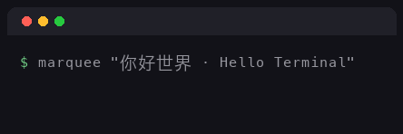

# marquee

Scroll text across your terminal — on one line, measured in display columns, and
correct for CJK, emoji and mixed-width text.



The package on crates.io is **`terminal-marquee`** (the name `marquee` was taken
in 2023 by an unrelated crate); the binary it installs is `marquee`.

## Demo

The GIF above is a real capture of `marquee "你好世界 · Hello Terminal"` in a
40-column terminal, played back one column per 60 ms (the default is 50 ms).
These are six frames from the run that includes the rocket:

```text
$ marquee "你好世界 · Hello Terminal 🚀"
                    你好世界 · Hello Ter
              你好世界 · Hello Terminal
        你好世界 · Hello Terminal 🚀
  你好世界 · Hello Terminal 🚀
 Hello Terminal 🚀
 Terminal 🚀
```

Every frame is exactly the terminal's width, `你好世界` counts as 8 columns, the
rocket as 2, and no frame ever splits a character in half.

## Installation

From crates.io:

```sh
cargo install terminal-marquee
```

From a checkout:

```sh
git clone https://github.com/yaoyao-hunter/marquee
cargo install --path marquee
```

Both install a binary called `marquee`. It needs no configuration, no data files
and no network at run time.

## Usage

```sh
marquee "你好世界 · Hello Terminal 🚀"
```

The marquee takes over the line the cursor is on: it hides the cursor, scrolls
the text there, and never touches anything else — no alternate screen, the
scrollback stays intact. On exit, in every path — the cycles ran out, Ctrl+C,
even a panic — the line is erased, the cursor is shown again and raw mode is
left behind, so the shell prompt lands on a clean line.

It loops forever by default. Stop it with Ctrl+C, or bound it:

```sh
marquee --once " deploying… "          # one cycle, then exit
marquee --repeat 3 " hello "           # exactly three cycles
```

Exit codes:

| code | meaning |
| --- | --- |
| 0 | the cycles ran out, or you stopped it with Ctrl+C |
| 1 | drawing failed (a real I/O error) |
| 2 | usage: no text, blank text, or a bad flag |

Redirected output behaves like a Unix citizen: with stdout not a terminal, each
frame becomes one plain line with no escape bytes, paced as usual, and when the
reader goes away (`marquee … | head -3`) marquee exits 0 in silence instead of
printing "Broken pipe".

## Unicode & CJK

Widths are counted the way terminals count them, in display columns:

- CJK characters count 2 (`你好世界` = 8 columns)
- emoji count 2 (`🚀`), combining marks count 0
- a family joined by zero-width joiners is one unit of 2 columns
- text is segmented into grapheme clusters, never `chars()` or `len()`

A cluster that would straddle the edge of the frame is dropped for that frame
rather than split — a terminal cannot draw half a `你` — and the frame is
padded back out to the exact width, so nothing shifts and nothing wraps.

When the terminal is resized mid-scroll, the next frame is already the new
width, with the text kept at the same point of its trip.

## Piping text

Text can come from a pipe:

```sh
echo "正在部署..." | marquee
git log --oneline -1 | marquee --speed 30
```

The rule when both are possible, in order:

1. A positional `TEXT` wins, and stdin is never read.
2. With no `TEXT`, piped stdin is read to EOF: each line is trimmed, blank
   lines are dropped, and the rest are joined with a single space — a marquee
   scrolls one line.
3. With no `TEXT` and a terminal on stdin, marquee refuses to block: it exits 2
   with a message instead of sitting there waiting for you to type.

Blank input is refused either way (there would be nothing to scroll).

## tmux

marquee works inside tmux and other multiplexers. Resizing the pane sends the
resize to the program the moment it happens — the very next frame is drawn at
the new width, with the text kept at the same point of its trip rather than
wrapping or stranding. Ctrl+C stops it cleanly: cursor visible, raw mode off,
exit 0. The line it used is given back to the pane, scrollback untouched.

## Options

| option | default | meaning |
| --- | --- | --- |
| `TEXT` (positional) | — | the text to scroll; otherwise piped stdin |
| `--speed <MS>` | 50 | milliseconds per column step (1–10000) |
| `--fps <FPS>` | — | frames per second (1–1000); conflicts with `--speed` |
| `--direction <left\|right>` | `left` | which edge the text enters from |
| `--bounce` | off | reverse at both edges instead of wrapping |
| `--gap <COLUMNS>` | 8 | blank columns between cycles |
| `--once` | — | scroll exactly one cycle, then exit |
| `--repeat <N>` | — | scroll exactly N cycles; conflicts with `--once` |
| `--align <left\|center\|right>` | `left` | accepted, currently no effect — see below |
| `--no-color` | — | accepted, currently no effect — see below |

`--speed`/`--fps` and `--once`/`--repeat` each conflict with each other, and
marquee says so rather than guessing. `--align` and `--no-color` are parsed and
validated but do nothing yet: placement of text shorter than the terminal and
colour output are both still to come, and the flags are reserved for them.
Everything else above does exactly what it says.

## Development

```sh
cargo fmt --check
cargo clippy --all-targets --all-features -- -D warnings
cargo test
cargo run -- "你好世界 · Hello Terminal 🚀"   # the quickest smoke test
```

Where the behaviour lives:

| module | what it owns |
| --- | --- |
| `src/unicode.rs` | grapheme clusters with display widths, precomputed once |
| `src/cli.rs` | the command line and the TEXT-vs-stdin precedence rule |
| `src/terminal.rs` | raw mode, resizes, Ctrl+C, restoring the terminal |
| `src/marquee.rs` | the scroll engine: one column of travel per frame |
| `src/renderer.rs` | frame drawing, pacing, and the clean exit |
| `src/main.rs` | the run loop that ties them together |
| `src/bigfont/` | the committed glyph atlas: parser, cluster mapping, rasterizer |
| `tools/gen-bigfont` | regenerates the atlas from the Fusion Pixel Font BDF release |

### Big-font assets

`assets/bigfont-12px-zh-hans.bin` is a compact glyph atlas generated at
development time from the official Fusion Pixel Font BDF release by
`tools/gen-bigfont` and committed to the repo, so builds stay offline and
`cargo install` needs no font downloads. The binary format, the recorded
provenance (release tag + sha256) and the regeneration procedure are in
[docs/bigfont-asset-format.md](docs/bigfont-asset-format.md).

## Acknowledgements

- [Fusion Pixel Font](https://github.com/TakWolf/fusion-pixel-font) by TakWolf,
  licensed under the [SIL Open Font License 1.1](assets/fusion-pixel/LICENSE-OFL).
  It merges glyphs from Ark Pixel Font, Cubic 11 and Galmuri; the full
  copyright notices live in
  [assets/fusion-pixel/COPYRIGHT.md](assets/fusion-pixel/COPYRIGHT.md).

MIT licensed — see [LICENSE](LICENSE).
