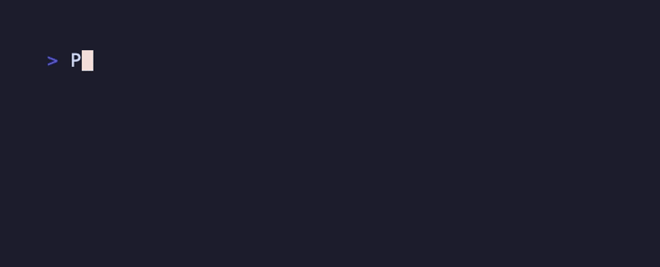

<div align="center">

# marquee

**终端跑马灯**：按显示列宽精确滚动的字幕工具，正确处理中日韩、emoji 与
混合宽度的 Unicode。单行模式与像素大字体模式，主题可 DIY，色彩可以很花。

[安装](#安装与配置) · [用法](#详细用法与配图) · [主题](#主题示例) · [English](README.en.md)

</div>

## 特性

- **列宽正确**：以终端显示列（而不是字符数）计量滚动，宽字符不劈半、
  emoji 不散架、组合字符不丢
- **两种模式**：单行滚动；`--big` 像素大字体（半块字符拼出 `6·N` 行大字）
- **连续滚动**：`--continuous` 让下一份文字紧跟着上一份，LED 屏幕流效果
- **主题系统**：11 个内置主题，含彩虹调色盘；自己的主题写在
  `~/.config/marquee/themes.toml`，无需改代码
- **零残留**：不进备用屏幕、每帧一次带缓冲写入、退出时擦干净自己，
  shell 提示符完好如初
- **可管道**：`echo 部署中… | marquee`，断管静默退出

## 安装与配置

### 要求

- macOS 或 Linux
- Rust 1.85+（edition 2024）
- 支持半块字符（`█ ▀ ▄`）与 256 色的终端（大字体/主题需要）

### 安装

```sh
git clone https://github.com/yaoyao-hunter/marquee.git
cd marquee
cargo install --path .        # 装进 ~/.cargo/bin
```

不想安装也可以直接跑：`cargo run --release -- "你好世界"`。

### 配置

| 配置项 | 位置 | 说明 |
|---|---|---|
| 用户主题 | `~/.config/marquee/themes.toml` | `[名字]` + 颜色/加粗/色带，见[主题](#主题示例) |
| 主题文件位置 | `XDG_CONFIG_HOME/marquee/themes.toml` | 有 XDG 时优先 |
| `NO_COLOR` | 环境变量 | 非空则强制纯色输出（[no-color.org](https://no-color.org) 约定） |
| `COLUMNS` / `LINES` | 环境变量 | 输出重定向（管道/文件）时假定的终端尺寸，默认 80×24 |

无配置文件也能用：所有主题内置，配置只是覆盖与新增。

## 快速上手

```sh
marquee "你好世界 · Hello Terminal 🚀"
```



## 详细用法与配图

### 速度与方向

```sh
marquee --speed 30 "快一点"          # 每帧 30ms（默认 50）
marquee --fps 25 "25 帧每秒"         # 与 --speed 互斥
marquee --direction right "从左往右"  # 默认 left
```

### 连续滚动

下一份文字隔着 `--gap` 列紧跟着上一份，不等待清屏，无缝循环：

```sh
marquee --continuous --gap 8 " ON AIR · STREAMING LIVE " --theme rainbow
```


`--once` / `--repeat N` 按周期计数；`--continuous` 与 `--bounce` 互斥。

### 大字体模式

像素级放大（`--scale N`，字形 `12·N` 列 × `6·N` 行），半块字符平滑进出
屏幕边缘：

```sh
marquee --big --scale 2 "ON AIR" --theme alarm
```


终端必须容得下它：至少 `12·N` 列 × `6·N + 1` 行，否则开局退出码 2 并
提示所需尺寸；运行中窗口变小则自动降级继续滚。

### 管道输入

```sh
echo "正在部署 ..." | marquee
git log --oneline -1 | marquee --speed 30
```

无位置参数时读管道 stdin：逐行去空白、空行丢弃、单空格连接。

### 完整参考

- 手册页：`man docs/marquee.1`（所有标志、退出码、环境变量）
- 大字体模式手册：[docs/manual.md](docs/manual.md)，
  中文版 [docs/manual.zh-CN.md](docs/manual.zh-CN.md)
- 英文 README：[README.en.md](README.en.md)

## 主题示例

```sh
marquee "好消息 · marquee v1 正式发布" --theme matrix
marquee "sunset · 落日色带 warm bands" --theme sunset
```


自己的主题写在 `~/.config/marquee/themes.toml`（或 `--theme-file` 指定），
配置层与绘制层解耦，加主题不用改代码：

```toml
[sunset]
fg = ["#ff5e62", "#ff9966", "#ffd194"]   # 颜色列表 = 调色盘
band = 4                                  # 每色占几列（默认 1）

[alarm]
fg = "bright-red"                         # 单色 = 纯色主题
bold = true
```

调色盘沿屏幕列铺色带、文字从色带中流过；比色带宽的字形会同时显示多种
颜色。`fg`/`bg` 支持 16 个 ANSI 颜色名或 `#rrggbb`，还有 `bold/dim/
italic/underline`。

<p align="center">
  <a href="docs/themes.md"><b>🎨 查看全部 11 个内置主题（含配图与 TOML 定义）→</b></a>
</p>

## 开发

```sh
cargo fmt --check
cargo clippy --all-targets --all-features -- -D warnings
cargo test
```

文档配图（GIF）用 [vhs](https://github.com/charmbracelet/vhs) 录制，
tape 在 [`tools/vhs/`](tools/vhs/)：`cd docs/images && vhs ../../tools/vhs/single-line.tape`。

## 许可

[MIT](LICENSE)
